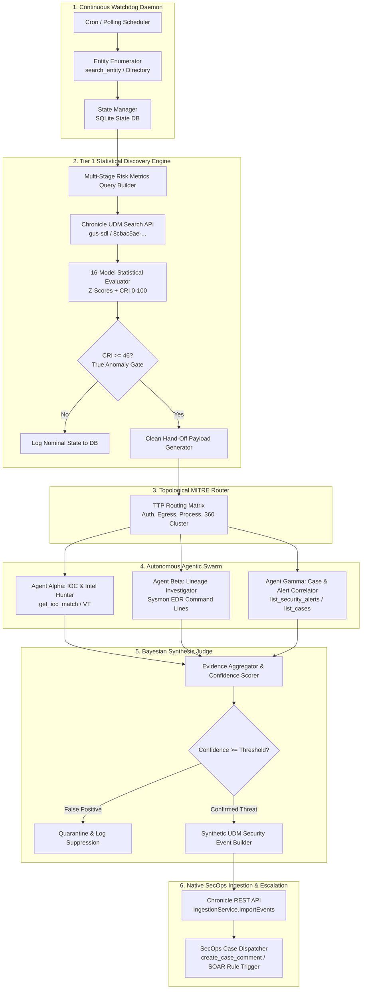

# 🏛️ Agentic UEBA System Architecture (Tier 2)

Welcome to the **Agentic UEBA** project. This document defines the end-to-end architecture, component interfaces, data contracts, and implementation roadmap for the **Tier 2 Autonomous Statistical Watchdog & Multi-Agent Investigation Swarm**.

---

## 🧭 System Philosophy: The Two-Tier Architecture

The enterprise threat detection system is structured into two decoupled, single-responsibility layers:

```
┌────────────────────────────────────────────────────────────────────────────────────────┐
│                        THE TWO-TIER THREAT DETECTION PARADIGM                          │
│                                                                                        │
│  [ TIER 1: THE ENGINE — Non-Deterministic Discovery Skill (v1.0 Core) ]                │
│  • Responsibility: Multi-Stage UDM Search + Pre-Computed Risk Metrics (Stage 1)        │
│  • Mathematical Portfolio: 16 Statistical Models (Bayes, MAD, CUSUM, 360° Radar)       │
│  • Normalization Layer: Calibrated Risk Index (CRI [0–100], Sigmoid α=0.6, Z_mid=3.0σ) │
│  • Output: Standardized Clean Hand-Off (CH) Anomaly Payload (JSON)                     │
│                                                                                        │
│                                      │ (Clean Hand-Off Contract)                       │
│                                      ▼                                                 │
│                                                                                        │
│  [ TIER 2: THE SYSTEM — Continuous Watchdog & Autonomous Agentic Swarm ]               │
│  • Component 1: Continuous Entity Watchdog (Scheduled Enterprise Scanning Daemon)      │
│  • Component 2: Topological MITRE ATT&CK Router (Maps Anomaly Vectors to TTPs)         │
│  • Component 3: Agentic Investigation Swarm (IOCs, Process Lineage, Prior Alerts)      │
│  • Component 4: Bayesian Synthesis Judge (Multi-Source Evidence Aggregator)            │
│  • Component 5: Native Chronicle REST Ingestor (events:import Forwarder-Free Ingestion)│
└────────────────────────────────────────────────────────────────────────────────────────┘
```

---

## 🗺️ High-Level System Architecture Diagram



---

## 🧩 Core Subsystem Specifications

### Subsystem 1: Continuous Entity Watchdog (`daemon/`)
* **Role**: Runs as a daemon or scheduled runner (hourly/daily) that monitors high-risk and enterprise-wide cohorts.
* **Responsibilities**:
  * Enumerate active entities (users and assets) via directory services and Chronicle Entity APIs (`search_entity`, `summarize_entity`).
  * Maintain persistent state (`data/state.db`) to record evaluated windows, historical personal baselines, and suppression timers.
  * Construct and execute multi-stage risk metrics queries against Chronicle SecOps (`gus-sdl`, customer: `8cbac5ae-8267-4da7-b405-cdbc6fa3f1d5`).

---

### Subsystem 2: The Statistical Evaluator & Clean Hand-Off (`evaluator/`)
* **Role**: Applies the Tier 1 mathematical portfolio to extract multi-sigma deviations and generate structured hand-offs.
* **Core Metrics Evaluated**:
  * User: 8 Macro Dimensions (`metrics.auth_attempts_total`, `metrics.failed_auth_attempts_total`, etc.).
  * Host: 14 Macro Dimensions (`metrics.process_launches_total`, `metrics.network_bytes_outbound`, etc.).
* **Statistical Gate**:
  * Computes $Z_{	ext{Self}}$ (30d historical drift) and $Z_{	ext{Peer}}$ (Bayesian peer group divergence).
  * Computes **Calibrated Risk Index (CRI)**:
    $$	ext{CRI}(Z) = 	ext{round}\left(rac{100}{1 + \exp(-0.6 \cdot (Z - 3.0))}
ight)$$
  * Filters for findings with $	ext{CRI} \ge 46$ ($Z \ge 3.0\sigma$).
* **Output**: Produces the typed **Clean Hand-Off (CH)** JSON payload.

---

### Subsystem 3: Topological MITRE ATT&CK Router (`router/`)
* **Role**: Analyzes the topology of the anomaly (isolated spike, longitudinal drift, or cross-sector cluster) and routes targeted investigation tasks to the swarm.

| Anomaly Topology | Trigger Signals | Mapped MITRE Tactics | Swarm Playbook Activated |
| :--- | :--- | :--- | :--- |
| **Auth Breakout** | $\Delta Z_{	ext{Auth}} \ge +3.0\sigma$ | `TA0001` Initial Access<br>`TA0006` Credential Access | **Credential Access & Brute Force Playbook** |
| **Volume Asymmetry Inversion** | $\Psi_{	ext{Net}} \ge +3.0\sigma$, Outbound $\gg$ Inbound | `TA0010` Exfiltration<br>`TA0011` Command & Control | **Data Exfiltration & C2 Beaconing Playbook** |
| **Longitudinal CUSUM Drift** | $S_T^+ \ge 4.0\sigma$ over 7–14 days | `TA0003` Persistence<br>`TA0005` Defense Evasion | **Slow-and-Low Stealth Persistence Playbook** |
| **360° Multi-Sector Cluster** | $D_{	ext{Omni}} \ge 3.5\sigma$ across Auth + Proc + Net | Full ATT&CK Killchain | **Critical Active Breach Playbook** |

---

### Subsystem 4: Autonomous Agentic Swarm (`swarm/`)
* **Role**: Spawns specialized investigation sub-agents concurrently to harvest micro-telemetry and validate ground-truth evidence.

```
                   ┌────────────────────────────────────────┐
                   │        SWARM ORCHESTRATOR              │
                   └──────────────────┬─────────────────────┘
                                      │
         ┌────────────────────────────┼────────────────────────────┐
         ▼                            ▼                            ▼
┌──────────────────┐        ┌──────────────────┐        ┌──────────────────┐
│  AGENT ALPHA     │        │  AGENT BETA      │        │  AGENT GAMMA     │
│  IOC & Intel     │        │  Process Lineage │        │  Case & Alert    │
│  Hunter          │        │  Investigator    │        │  Correlator      │
├──────────────────┤        ├──────────────────┤        ├──────────────────┤
│ • get_ioc_match  │        │ • Sysmon Event 1 │        │ • list_alerts    │
│ • Domain / IP VT │        │ • Parent/Child   │        │ • list_cases     │
│ • Threat Feeds   │        │ • Token / RID    │        │ • Prior History  │
└──────────────────┘        └──────────────────┘        └──────────────────┘
```

1. **Agent Alpha (IOC & Threat Intel Hunter)**:
   * Queries `get_ioc_match` for all outbound IPs, domains, and process file hashes observed during the burst window.
2. **Agent Beta (Process Lineage & Micro-Telemetry Investigator)**:
   * Queries UDM micro-telemetry (`WINDOWS_SYSMON`, `CS_EDR`) to reconstruct parent/child execution trees, command lines, and integrity token elevation levels.
3. **Agent Gamma (Case & Alert Correlator)**:
   * Queries `list_security_alerts` and `list_cases` to check if this entity or host is part of an ongoing open incident.

---

### Subsystem 5: The Bayesian Synthesis Judge (`judge/`)
* **Role**: Aggregates the evidence gathered across all swarm agents into a unified Bayesian Confidence Score ($P(	ext{Malicious} \mid 	ext{Evidence})$).
* **Decision Logic**:
  * If the anomaly is corroborated by malicious process lineage (e.g. `vssadmin`, `powershell -enc`, `certutil`) or known IOC matches $\implies$ **High-Confidence Incident Confirmed**.
  * If the anomaly is explained by scheduled maintenance or authorized IT batch scripts $\implies$ **Suppressed as Business-as-Usual Drift**.

---

### Subsystem 6: Native Chronicle Ingestor & Case Dispatcher (`ingestion/`)
* **Role**: Ingests confirmed incidents directly into Chronicle SIEM via REST and dispatches alerts to SOAR.
* **REST Endpoint**:
  ```http
  POST https://us-chronicle.googleapis.com/v1alpha/projects/gus-sdl/locations/us/instances/8cbac5ae-8267-4da7-b405-cdbc6fa3f1d5/events:import
  ```
* **Payload Structure**: Native `{"udm": { ... }}` JSON object without forwarder wrappers.
* **Context Preservation**: Populates `target.resource.attribute.labels` with model type, $Z$-score, and CRI score so human analysts and downstream SOAR playbooks receive complete statistical context immediately.

---

## 📋 Data Contracts & Schemas

### 1. Clean Hand-Off (CH) Schema (Tier 1 $	o$ Tier 2)

```json
{
  "target_entity": "frank.kolzig",
  "entity_type": "USER",
  "evaluated_window": "2026-08-25",
  "primary_model": "COHORT_BAYESIAN_3STAGE",
  "metrics_evaluated": [
    {
      "metric_name": "metrics.auth_attempts_total",
      "observed_value": 103,
      "personal_30d_mean": 103.0,
      "personal_z_score": 0.0,
      "cohort_peer_mean": 76.8,
      "cohort_peer_stddev": 6.3,
      "peer_z_score": 4.16,
      "cri_score": 67,
      "severity": "MEDIUM_OUTLIER"
    }
  ],
  "outlier_topology": "ISOLATED_PEER_BREAKOUT",
  "composite_distance_d": 4.16,
  "suggested_mitre_tactics": ["TA0001_INITIAL_ACCESS", "TA0006_CREDENTIAL_ACCESS"],
  "suggested_mitre_techniques": ["T1078", "T1047", "T1003"],
  "associated_assets": ["activedir.stackedpads.local"],
  "associated_users": ["frank.kolzig"]
}
```

---

### 2. Native UDM Security Event Envelope (Tier 2 $	o$ Chronicle)

```json
{
  "parent": "projects/gus-sdl/locations/us/instances/8cbac5ae-8267-4da7-b405-cdbc6fa3f1d5",
  "inlineSource": {
    "events": [
      {
        "udm": {
          "metadata": {
            "eventTimestamp": "2026-08-25T19:03:00Z",
            "ingestedTimestamp": "2026-08-25T19:03:00Z",
            "productName": "SecOps Risk Metrics Hunter",
            "vendorName": "Google SecOps",
            "eventType": "GENERIC_EVENT",
            "productEventType": "STATISTICAL_RISK_ANOMALY",
            "description": "Risk Alert: frank.kolzig peer breakout +4.16σ (CRI: 67) with Shadow Copy creation"
          },
          "principal": {
            "user": {
              "userid": "frank.kolzig",
              "emailAddresses": ["frank.kolzig@stackedpads.local"],
              "department": "Information Technology",
              "title": "Windows Administrator"
            }
          },
          "target": {
            "hostname": "activedir.stackedpads.local",
            "asset": {
              "hostname": "activedir.stackedpads.local",
              "category": "Computer"
            },
            "resource": {
              "name": "STATISTICAL_RISK_ANOMALY",
              "attribute": {
                "labels": [
                  { "key": "Risk Source", "value": "Bayesian Peer Anomaly" },
                  { "key": "Model", "value": "COHORT_BAYESIAN_3STAGE" },
                  { "key": "Target Entity", "value": "frank.kolzig" },
                  { "key": "Peer Z-Score", "value": "+4.16σ" },
                  { "key": "CRI Score", "value": "67" },
                  { "key": "Severity Tier", "value": "MEDIUM_OUTLIER" },
                  { "key": "Cohort Baseline", "value": "76.8 logins/day (IT Team)" },
                  { "key": "Observed Value", "value": "103 logins" },
                  { "key": "MITRE Tactics", "value": "TA0001_INITIAL_ACCESS, TA0006_CREDENTIAL_ACCESS" },
                  { "key": "MITRE Techniques", "value": "T1078, T1047, T1003" },
                  { "key": "Evidence Summary", "value": "4 Sysmon process executions: WMI invoking vssadmin create shadow /for=C:" }
                ]
              }
            }
          },
          "securityResult": [
            {
              "riskScore": 67,
              "severity": "MEDIUM",
              "summary": "User frank.kolzig exceeded IT peer baseline by +4.16σ (CRI: 67 / Medium Outlier)"
            }
          ]
        }
      }
    ]
  }
}
```

---

## 🗂️ Proposed Directory Structure

```
agentic_ueba/
├── ARCHITECTURE.md                 # System Architecture & Technical Specifications (This File)
├── GEMINI.md                       # Operational Assistant Instructions
├── config.yaml                     # SecOps Tenant Settings (Project ID, Customer ID, Region)
├── data/
│   └── state.db                    # SQLite Persistent State & Incident Ledger
├── src/
│   ├── __init__.py
│   ├── main.py                     # CLI Entrypoint & Runner
│   ├── daemon/                     # Continuous Watchdog & Entity Polling Scheduler
│   │   ├── __init__.py
│   │   ├── scheduler.py
│   │   └── entity_enumerator.py
│   ├── evaluator/                  # Risk Metrics Query Execution & Statistical Evaluation
│   │   ├── __init__.py
│   │   ├── query_builder.py
│   │   ├── stats_engine.py         # CRI Sigmoid, Z-Score, CUSUM Calculators
│   │   └── handoff_generator.py    # Clean Hand-Off Builder
│   ├── router/                     # Topological MITRE ATT&CK Routing Matrix
│   │   ├── __init__.py
│   │   └── ttp_mapper.py
│   ├── swarm/                      # Multi-Agent Investigation Swarm
│   │   ├── __init__.py
│   │   ├── orchestrator.py         # Swarm Task Dispatcher & Fan-Out
│   │   ├── agents/
│   │   │   ├── ioc_hunter.py       # Agent Alpha: IOC Matches & Intel Lookups
│   │   │   ├── lineage_tracer.py   # Agent Beta: Process Lineage & Command Lines
│   │   │   └── alert_correlator.py # Agent Gamma: Case & Security Alert History
│   │   └── judge.py                # Bayesian Synthesis Judge & Confidence Scorer
│   └── ingestion/                  # Native Chronicle REST Ingestion Client
│       ├── __init__.py
│       ├── chronicle_client.py     # Native events:import REST Client (ADC Auth)
│       └── case_dispatcher.py      # SOAR Case Dispatcher & Comment Updater
└── tests/                          # Unit & Integration Test Suites
    ├── test_cri.py
    ├── test_router.py
    └── test_swarm.py
```

---

## 🚀 Phased Implementation Roadmap

| Phase | Milestone | Core Deliverables |
| :---: | :--- | :--- |
| **Phase 1** | **Core Foundation & Ingestion Client** | `chronicle_client.py` (Native `events:import` via ADC), `config.yaml`, and `state.db` SQLite schema. |
| **Phase 2** | **Statistical Evaluator & CH Generator** | `query_builder.py` and `stats_engine.py` implementing the 16 Tier 1 models + CRI Sigmoid normalization. |
| **Phase 3** | **MITRE Router & TTP Matrix** | `ttp_mapper.py` mapping outlier topologies to MITRE tactics, techniques, and swarm investigation tasks. |
| **Phase 4** | **Swarm Orchestrator & Agents** | `orchestrator.py` and sub-agents (`ioc_hunter.py`, `lineage_tracer.py`, `alert_correlator.py`). |
| **Phase 5** | **Bayesian Judge & End-to-End Daemon** | `judge.py` synthesis aggregator, `scheduler.py` daemon loop, and automated Chronicle Case escalation. |
